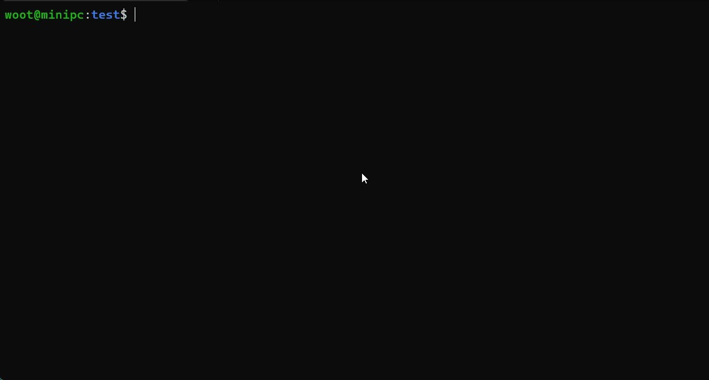
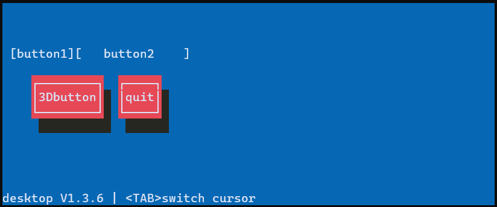
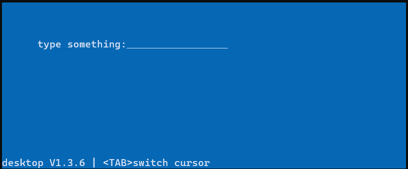
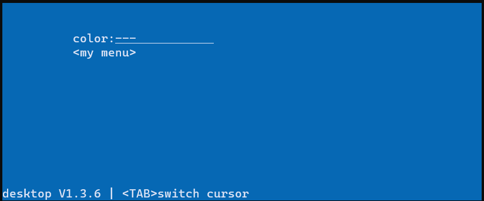
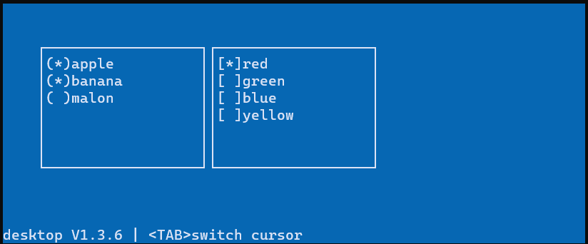

# ncurses-widget
## 简介
这是基于 ncursesw 实现的终端窗口界面(terminal user interface,TUI)，
方便在终端界面绘制简单的控件和窗口。如下：


部分样式参考了 [NewT](https://pagure.io/newt) 等项目

特性：  
1. 支持 UTF-8 中文;
2. 支持窗口移动，隐藏和关闭;
3. 支持鼠标事件，如点击，滚轮或拖拽;

同时也有欠缺：
1. 无法改变窗口大小，且不响应终端界面的大小改变
2. 鼠标事件并非每种终端类型都支持，不同的终端软件可能会有不一样的表现
3. 暂不支持鼠标拖动选中文本复制

## 编译
例程在 ncursesw5.9 和 ncurses6.2 测试通过。
请先确保本机上已有 ncursesw ，如果不需要 UTF-8 支持则可用 ncurses：
```
apt install libncursesw5-dev
```

当前文件夹执行 `make` 编译为库。
test 文件夹下有基础示例，每个文件都为单一示例:
```
gcc test/demo.c -o demo -L./ -lnwidget -lncursesw -lpanelw -I./include -Wall
```

可到此目录下编译所有例程：
```
cd test
make
# ./demo
```

note:终端的 LC_ALL 相关变量最好设置为 UTF-8 相关

## 开始
界面库的使用将重新接管程序的标准输出，请先确保当前终端没有其他程序的打印。
程序的整体框架如下：
```
#include "wg_component.h"
int main()
{
	desktop_init(NULL);
	desktop_taskbar_init(); // if you need taskbar

	/* create your widget here ... */

	return desktop_editing();
}
```
desktop_init() 接受一个界面主题设置结构体，可根据个人喜好定制颜色配置，
传入 NULL 则启用默认主题。初始化过后可得到桌面的大小，此处 ncurses 的 LINES 
和 COLS 变量依然有效，且桌面的布局坐标系统沿用 ncurses 的规则，
即以终端的左上角为原点(0,0),横向为 X 轴，以一个字符显示宽度为单位，
纵向为 Y 轴，以字符显示高度(即一行)为单位。创建的控件或窗体大小都应在桌面范围内。
最后进入桌面循环，标准输入交由桌面接管。


## 创建
动态组件一般由 wg_xxx_create() 函数创建,然后需要调用 wg_xxx_put() 
把创建的控件放置到对应的位置并显示:
```
#include "wg_component.h"
int main()
{
	desktop_init(NULL);
	desktop_taskbar_init(); // if you need taskbar

	struct button = wg_button_create("clicked me",-1);
	wg_button_put(btn,&desktop,0,0);

	return desktop_editing();
}
```
如上即可在桌面的 (0,0) 位置创建一个按钮。除了按钮控件，诸如窗体、表格、
文本显示框等控件的创建模式都是如此。

## 信号
部分控件提供了用户状态信号回调函数，如果控件结构体包含了 `struct nwidget_signal`
结构体，则可用宏定义 `wg_signal_connect` 进行函数回调注册，控件在出发了事件后会调用。
目前的用户信号大致有以下内容：


## button


## editline


## dropdown&menu


## checkbox&radio


## table

## textarea

## 互斥量
原则上，调用 ncurses 中的 werase(),waddstr() 等接口时应对整个屏幕上锁，
防止在主线程的 desktop_editing() 中 update_panels()/doupdate() 产生冲突。
同时，有些控件带有各自的数据，为了保证数据的一致性也应在操作数据时对控件自身上锁。
另外，控件如触发了用户信号函数如 sig.clicked() ，应在调用前解锁所有的操作。
